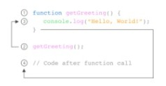

# Writing Week 2

# JavaScript Dasar

## Java Script Function </br>
- **Definisi**</br>
Function adalah sebuah blok kode dalam sebuah grup untuk menyelesaikan 1 task/1 fitur. Saat kita membutuhkan fitur tersebut nantinya, kita bisa kembali menggunakannya.

- **Membuat Function**
    ```js
    function greeting() {
        return 'Assalamualaikum';
    };
    ```
    

- **Memanggil Function** </br>
untuk memanggil sebuah function, maka kita harus memanggil nama functionnya dengan menuliskan 
    ```js
    console.log(namafunction());
    namafunction();
    ```
    analoginya seperti ini:</br>
    

- **Parameter Function**</br>
    - Dengan parameter, function dapat menerima sebuah inputan data dan menggunakannya untuk melakukan task/tugas.</br>
    - Saat membuat function/fitur, kita harus tahu data-data yang dibutuhkan. Misalnya saat membuat function penambahan 2 buah nilai. Data yang dibutuhkan adalah 2 buah nilai tersebut.</br>
- **Argumen Function**</br>
    1. Argumen adalah nilai yang digunakan saat memanggil function.
    2. Jumlah argumen harus sama dengan jumlah parameternya
    3. Jadi jika di function penambahan ada 2 parameter nilai saat membuat function. Saat memanggil function kita gunakan 2 buah nilai argumen.
    contoh :
    ```js
    function penambahan(a, b) {
        return a + b;
    }
     console.log(penambahan(4, 2))
    ```
    pada contoh di atas tersebut maka akan menghasilkan output 6, karena </br> 
    a = 4 </br>
    b = 2 </br>
    Nantinya saat kita mengembangkan aplikasi dengan skala besar, function sangat sangat dibutuhkan agar kita dapat dengan mudah memanage code dan tracing code jika ada error. </br>
- **Default Parameters**</br>
    Default paramaters digunakan untuk memberikan nilai awal/default pada parameter function. Default parameters bisa digunakan jika kita ingin menjaga function agar tidak error saat dipanggil tanpa argumen</br>
- **Function Helper**</br>
    Dengan Function Helper ini Kita bisa menggunakan function yang sudah dibuat pada function lain.
- **Arrow Function**</br>
    Arrow function adalah cara lain menuliskan function. Ini adalah fitur terbaru yang ada pada ES6 (Javascript Version) </br>
    contoh:
    ```js
    const greeting = () => {
        return 'Assalamualaikum';
    };
        const penambahan = (a, b) => {
    return a + b;
    };
    ```
- **Short Syntax Function**
    - Zero Parameters
    ```js
    const functionName =() => {};
    ```
    - One Parameters
    ```js
    const functionName = paramOne => {};
    ```
    - Two Or More Parameters
    ```js
    const functionName = (paramOne, ParamTwo) => {};
    ```
    - Single-line Block
    ```js
    const sumNumbers = number => number + number;
    ```
    - Multi-Line Block
    ```js
    const sumNumbers = number => {
        const sum = number + number;
        return sum; 
    }
    ```

# JavaScript-Scope</br>
- **Definisi** </br>
    Scope adalah konsep dalam flow data variabel. Menentukan suatu variabel bisa diakses pada scope tertentu atau tidak. Analoginya seperti Kita semua bisa melihat bintang-bintang dilangit karena bumi bersifat global. Namun jika kamu tinggal di Bandung, kamu tidak akan bisa melihat monas yang berada di jakarta. Monas bersifat local yaitu hanya berada di Jakarta.</br>
- **Blocks**</br>
    Blocks adalah code yang berada didalam curly braces {}. Conditional, function, dan  looping menggunakan blocks.</br>
- **Global Scope**</br>
    Global scope berarti variabel yang kita buat dapat diakses dimanapun dalam suatu file. Agar menjadi Global Scope, suatu variabel harus dideklarasikan diluar Blocks.
    contoh:
    ```js
    let myName = 'Puput';

    function greeting() {
       return myName;
    }
    console.log(myName);
    ```
    maka hasil keluaranya akan seperti ini:</br>
     </br>
- **Local Scope**</br>
    Local scope berarti kita mendeklarasikan variabel didalam blocks seperti function, conditional, dan looping. Maka variabel hanya bisa diakses didalam blocks saja. Tidak bisa diakses diluar blocks.
    contoh:
    ```js
    function greeting() {
        let myName = 'Puput';
        return myName;
    }
    console.log(greeting())
    console.log(myName); //Uncaught ReferenceError: myName is not defined karena scope lokal
    ```

# Tipe Data JavaScript
- **Definisi**</br>
    Tipe data adalah klasifikasi yang kita berikan untuk berbagai macam data yang digunakan dalam programming. Semua bahasa pemrograman memiliki struktur data bawaan, tetapi ini sering berbeda dari satu bahasa ke bahasa lainnya </br>
- **JavaScript Type**</br>
    Himpunan tipe dalam bahasa JavaScript terdiri dari tipe data `Primitif` dan `Non-Primitif`
    - Nilai Primitif merupakan nilai ang tidak dapat diubah diwakili langsung pada tingkat bahasa terendah, nilai primitif diantaranya:</br>
        1. Boolean type 
            Boolean mewakili entitas logis dan dapat memiliki dua nilai: `true` dan `false`. 
        2. Null type
            Jenis Null memiliki tepat satu nilai: `null`
        3. Undefined type
            Sebuah variabel yang belum diberi nilai memiliki nilai `undefined`
        4. Number type
            Ia mampu menyimpan angka floating-point positif `( Number.MIN_VALUE)` dan `( Number.MAX_VALUE)` serta angka floating-point negatif, tetapi bisa hanya menyimpan bilangan bulat dengan aman `( Number.MIN_SAFE_INTEGER)` dan `( Number.MAX_SAFE_INTEGER)`.
        5. BigInt type
            Tipe BigInt adalah primitif numerik dalam JavaScript yang dapat mewakili bilangan bulat dengan presisi arbitrer. Dengan BigInts, kita dapat dengan aman menyimpan dan mengoperasikan bilangan bulat besar bahkan di luar batas bilangan bulat aman untuk Numbers.
        6. String type
            Jenis String JavaScript digunakan untuk mewakili data tekstual
        7. Symbol type
            Simbol adalah nilai primitif yang unik dan tidak dapat diubah dan dapat digunakan sebagai kunci dari properti Objek (lihat di bawah). Dalam beberapa bahasa pemrograman, Simbol disebut `atom`.
    - Tipe data Non-Primitif adalah tipe data yang disimpan ke dalam memori. Primitif disimpan berdasarkan nilai sedangkan Non-Primitif (Objek) disimpan dengan referensi. tipe data non-primitif diantaranya
        1. Objek
        2. Array
        3. Fungsi

## String
- **Definisi**</br> 
    Objek `String` digunakan untuk mewakili dan memanipulasi urutan karakter. String berguna untuk menyimpan data yang dapat direpresentasikan dalam bentuk teks. Beberapa operasi yang paling sering digunakan pada string adalah memeriksa `length` membangun dan menggabungkannya menggunakan `+ and += string operators` memeriksa keberadaan atau lokasi substring dengan `indexOf()`metode, atau mengekstrak substring dengan `substring()`metode.
- **Membuat String** </br>
    String dapat dibuat sebagai primitif, from literal string, atau sebagai objek, menggunakan String()konstruktor:
    contoh
    ```js
    const string1 = "A string primitive";
    const string2 = 'Also a string primitive';
    const string3 = `Yet another string primitive`;
    ```
- **Creating Strings (Mengakses String)** </br>
    Ada dua cara untuk mengakses karakter individu dalam sebuah string. Yang pertama adalah `charAt()` metodenya
    ```js
    'cat'.charAt(1) // gives value "a"
    ```
    Cara lain adalah dengan memperlakukan string sebagai objek seperti array, di mana karakter individu sesuai dengan indeks numerik:</br>
    ```js
    'cat'[1] // gives value "a"
    ```
- **Konstruktor**</br>
    - `String ()`</br>
        Membuat Stringobjek baru. Ia melakukan konversi tipe ketika dipanggil sebagai fungsi, bukan sebagai konstruktor, yang biasanya lebih berguna.
- **Metode Statis**
    - `String.fromCharCode()`</br>
        Mengembalikan string yang dibuat dengan menggunakan urutan nilai Unicode yang ditentukan.
    - `String.fromCodePoint()`</br>
        Mengembalikan string yang dibuat dengan menggunakan urutan titik kode yang ditentukan.
    - `String.raw()`</br>
        Mengembalikan string yang dibuat dari string template mentah.
- **Properti Instan**
    - `String.prototype.length`</br>
        Mencerminkan lengthstring. Hanya baca.
- **Metode Instan**
    - `String.prototype.at()`</br>
        Mengembalikan karakter (tepatnya satu unit kode UTF-16) pada index. Menerima bilangan bulat negatif, yang menghitung mundur dari karakter string terakhir.

    - `String.prototype.charAt()`</br>
        Mengembalikan karakter (tepatnya satu unit kode UTF-16) pada index.

    - `String.prototype.charCodeAt()`</br>
        Mengembalikan angka yang merupakan nilai unit kode UTF-16 pada nilai index.

    - `String.prototype.codePointAt()`</br>
        Mengembalikan bilangan bulat non-negatif yang merupakan nilai titik kode dari titik kode yang disandikan UTF-16 mulai dari yang ditentukan pos.

    - `String.prototype.concat()`</br>
        Menggabungkan teks dari dua (atau lebih) string dan mengembalikan string baru.

    - `String.prototype.includes()`</br>
        Menentukan apakah string panggilan berisi searchString.

    - `String.prototype.endsWith()`</br>
        Menentukan apakah string diakhiri dengan karakter string searchString.

    - `String.prototype.indexOf()`</br>
        Mengembalikan indeks dalam Stringobjek panggilan dari kemunculan pertama searchValue, atau -1jika tidak ditemukan.

    - `String.prototype.lastIndexOf()`</br>
        Mengembalikan indeks dalam Stringobjek panggilan dari kemunculan terakhir searchValue, atau -1jika tidak ditemukan.

    - `String.prototype.localeCompare()`</br>
        Mengembalikan angka yang menunjukkan apakah string referensi compareStringmuncul sebelum, sesudah, atau setara dengan string yang diberikan dalam urutan pengurutan.

    - `String.prototype.match()`</br>
        Digunakan untuk mencocokkan ekspresi reguler regexpdengan string.

    - `String.prototype.matchAll()`</br>
        Mengembalikan iterator dari semua regexpkecocokan.

    - `String.prototype.normalize()`</br>
        Mengembalikan Bentuk Normalisasi Unicode dari nilai string panggilan.

    - `String.prototype.padEnd()</br>`
        Pads string saat ini dari akhir dengan string yang diberikan dan mengembalikan string baru dengan panjang targetLength.

    - `String.prototype.padStart()`</br>
        Pads string saat ini dari awal dengan string yang diberikan dan mengembalikan string baru dengan panjang targetLength.

    - `String.prototype.repeat()`</br>
        Mengembalikan string yang terdiri dari elemen objek berulang countkali.

    - `String.prototype.replace()`</br>
        Digunakan untuk menggantikan kemunculan searchForpenggunaan replaceWith. searchFordapat berupa string atau Ekspresi Reguler, dan replaceWithdapat berupa string atau fungsi.

    - `String.prototype.replaceAll()` </br>
        Digunakan untuk mengganti semua kemunculan searchForpenggunaan replaceWith. searchFordapat berupa string atau Ekspresi Reguler, dan replaceWithdapat berupa string atau fungsi.

    - `String.prototype.search()`</br>
        Cari kecocokan antara ekspresi reguler regexpdan string panggilan.

    - `String.prototype.slice()`</br>
        Mengekstrak bagian string dan mengembalikan string baru.

    - `String.prototype.split()`</br>
        Mengembalikan array string yang diisi dengan memisahkan string panggilan pada kemunculan substring sep.

    - `String.prototype.startsWith()`</br>
        Menentukan apakah string pemanggilan dimulai dengan karakter string searchString.

    - `String.prototype.substring()`</br>
        Mengembalikan string baru yang berisi karakter string panggilan dari (atau di antara) indeks (atau indeks) yang ditentukan.

    - `String.prototype.toLocaleLowerCase()`</br>
        Karakter dalam string diubah menjadi huruf kecil dengan tetap menghormati lokal saat ini.

        Untuk sebagian besar bahasa, ini akan mengembalikan sama seperti toLowerCase().

    - `String.prototype.toLocaleUpperCase( [locale, ...locales])`</br>
        Karakter dalam string diubah menjadi huruf besar dengan tetap menghormati lokal saat ini.

        Untuk sebagian besar bahasa, ini akan mengembalikan sama seperti toUpperCase().

    - `String.prototype.toLowerCase()`</br>
        Mengembalikan nilai string panggilan yang dikonversi menjadi huruf kecil.

    - `String.prototype.toString()`</br>
        Mengembalikan string yang mewakili objek yang ditentukan. Mengganti Object.prototype.toString()metode.

    - `String.prototype.toUpperCase()`</br>
        Mengembalikan nilai string panggilan yang dikonversi menjadi huruf besar.

    - `String.prototype.trim()`</br>
        Memangkas spasi putih dari awal dan akhir string.

    - `String.prototype.trimStart()`</br>
        Memangkas spasi putih dari awal string.

    - `String.prototype.trimEnd()`</br>
        Memotong spasi putih dari akhir string.

    - `String.prototype.valueOf()`</br>
        Mengembalikan nilai primitif dari objek yang ditentukan. Mengganti Object.prototype.valueOf()metode.

    - `String.prototype[@@iterator]()`</br>
        Mengembalikan objek iterator baru yang berulang pada titik kode dari nilai String, mengembalikan setiap titik kode sebagai nilai String

## Number
- **Definisi**</br>
    Numberadalah objek pembungkus primitif yang digunakan untuk mewakili dan memanipulasi angka seperti 37atau -9.25.Konstruktor Numberberisi konstanta dan metode untuk bekerja dengan angka. Nilai jenis lain dapat dikonversi ke angka menggunakan Number()fungsi.
- **Konstruktor**</br>
    `Number()` Menciptakan Number nilai baru. Ketika Number dipanggil sebagai konstruktor (with `new`), ia menciptakan `Number` objek, yang bukan primitif. Misalnya, `typeof new Number(42) === "object"`, dan `new Number(42) !== 42` (walaupun `new Number(42) == 42)`.
- **Sifat statis**
    - Number.EPSILON</br>
    Interval terkecil antara dua angka yang dapat diwakili.

    - Number.MAX_SAFE_INTEGER</br>
    Integer aman maksimum dalam JavaScript (2 53 - 1).

    - Number.MAX_VALUE</br>
    Angka terwakili positif terbesar.

    - Number.MIN_SAFE_INTEGER</br>
    Integer aman minimum dalam JavaScript (-(2 53 - 1)).

    - Number.MIN_VALUE</br>
    Angka terkecil yang dapat diwakili positif—yaitu, angka positif yang paling dekat dengan nol (tanpa benar-benar menjadi nol).

    - Number.NaN</br>
    Nilai khusus " N ot a N umber".

    - Number.NEGATIVE_INFINITY</br>
    Nilai khusus mewakili tak terhingga negatif. Dikembalikan pada overflow.

    - Number.POSITIVE_INFINITY</br>
    Nilai khusus yang mewakili tak terhingga. Dikembalikan pada overflow.

    - Number.prototype</br>
    Memungkinkan penambahan properti ke Numberobjek.
- **Metode statis**
    - Number.isNaN()</br>
    Tentukan apakah nilai yang diteruskan adalah NaN.

    - Number.isFinite()</br>
    Tentukan apakah nilai yang diteruskan adalah bilangan berhingga.

    - Number.isInteger()</br>
    Tentukan apakah nilai yang diteruskan adalah bilangan bulat.

    - Number.isSafeInteger()</br>
    Tentukan apakah nilai yang diteruskan adalah bilangan bulat aman (angka antara -(2 53 - 1) dan 2 53 - 1).

    - Number.parseFloat()</br>
    Ini sama dengan parseFloat()fungsi global.

    - Number.parseInt()</br>
    Ini sama dengan parseInt()fungsi global.

- **Metode instan**
    - Number.prototype.toExponential()</br>
    Mengembalikan string yang mewakili angka dalam notasi eksponensial.

    - Number.prototype.toFixed()</br>
    Mengembalikan string yang mewakili angka dalam notasi titik tetap.

    - Number.prototype.toLocaleString()</br>
    Mengembalikan string dengan representasi sensitif bahasa dari nomor ini. Mengganti Object.prototype.toLocaleString()metode.

    - Number.prototype.toPrecision()</br>
    Mengembalikan string yang mewakili angka ke presisi tertentu dalam notasi titik tetap atau eksponensial.

    - Number.prototype.toString()</br>
    Mengembalikan string yang mewakili objek yang ditentukan dalam radix yang ditentukan ("basis"). Mengganti Object.prototype.toString()metode.

    - Number.prototype.valueOf()</br>
    Mengembalikan nilai primitif dari objek yang ditentukan. Mengganti Object.prototype.valueOf()metode.

## Math
- **Definisi** </br>
    `Math` adalah objek bawaan yang memiliki properti dan metode untuk konstanta dan fungsi matematika. Ini bukan objek fungsi. `Math` bekerja dengan Numbertipe Ini tidak bekerja dengan BigInt.Tidak seperti banyak objek global lainnya, `Math` bukan konstruktor. Semua properti dan metode Mathstatis
- **Sifat Statis**
    1. Math.E
    Konstanta Euler dan basis logaritma natural; kira -kira 2.718.
    2. Math.LN2
    Logaritma natural dari 2; kira -kira 0.693.
    3. Math.LN10
    Logaritma natural dari 10; kira -kira 2.303.
    4. Math.LOG2E
    Logaritma basis-2 dari E; kira -kira 1.443.
    5. Math.LOG10E
    Logaritma basis-10 dari E; kira -kira 0.434.
    6.  Math.PI
    Rasio keliling lingkaran dengan diameternya; kira -kira 3.14159.
    7. Math.SQRT1_2
    Akar kuadrat dari ; kira -kira 0.707.
    8. Math.SQRT2
    Akar kuadrat dari 2; kira -kira 1.414.
- **Metode statis**
   1. Math.abs()
    Mengembalikan nilai absolut dari x.
   2. Math.acos()
    Mengembalikan arccosinus dari x.
   3. Math.acosh()
    Mengembalikan arccosinus hiperbolik dari x.
    4. Math.asin()
    Mengembalikan arcsine dari x.
    5. Math.asinh()
    Mengembalikan arcsinus hiperbolik suatu bilangan.
    6. Math.atan()
    Mengembalikan arctangent dari x.
    7. Math.atanh()
    Mengembalikan arktangen hiperbolik dari x.
    8. Math.atan2()
    Mengembalikan arctangent dari hasil bagi argumennya.
    9. Math.cbrt()
    Mengembalikan akar pangkat tiga dari x.
    10. Math.ceil()
    Mengembalikan bilangan bulat terkecil yang lebih besar dari atau sama dengan x.
    11. Math.clz32()
    Mengembalikan jumlah bit nol terdepan dari bilangan bulat 32-bit x.
    12. Math.cos()
    Mengembalikan kosinus dari x.
    13. Math.cosh()
    Mengembalikan kosinus hiperbolik dari x.
    14. Math.exp()
    Mengembalikan e x , di mana x adalah argumen, dan e adalah konstanta Euler ( 2.718…, basis logaritma natural).
    15. Math.expm1()
    Mengembalikan pengurangan 1dari exp(x).
    16. Math.floor()
    Mengembalikan bilangan bulat terbesar yang kurang dari atau sama dengan x.
    17. Math.fround()
    Mengembalikan representasi float presisi tunggalx terdekat dari .
    18. Math.hypot()
    Mengembalikan akar kuadrat dari jumlah kuadrat argumennya.
    19. Math.imul()
    Mengembalikan hasil perkalian bilangan bulat 32-bit dari xdan y.
    20. Math.log()
    Mengembalikan logaritma natural (㏒ e ; juga, ) dari x.
    21. Math.log1p()
    Mengembalikan logaritma natural (㏒ e ; juga ) dari 1 + xuntuk bilangan x.
    22. Math.log10()
    Mengembalikan logaritma basis-10 dari x.
    23. Math.log2()
    Mengembalikan logaritma basis-2 dari x.
    24. Math.max()
    Mengembalikan bilangan terbesar dari nol atau lebih.
    25. Math.min()
    Mengembalikan angka terkecil dari nol atau lebih.
    26. Math.pow()
    Mengembalikan basis xke pangkat eksponen y(yaitu, xy).
    27. Math.random()
    Mengembalikan angka pseudo-acak antara 0dan 1.
    28. Math.round()
    Mengembalikan nilai bilangan yang xdibulatkan ke bilangan bulat terdekat.
    29. Math.sign()
    Mengembalikan tanda x, yang menunjukkan apakah xpositif, negatif, atau nol.
    30. Math.sin()
    Mengembalikan sinus dari x.
    31. Math.sinh()
    Mengembalikan sinus hiperbolik dari x.
    32. Math.sqrt()
    Mengembalikan akar kuadrat positif dari x.
    33. Math.tan()
    Mengembalikan tangen dari x.
    34. Math.tanh()
    Mengembalikan tangen hiperbolik dari x.
    35. Math.trunc()
    Mengembalikan bagian bilangan bulat dari x, menghapus digit pecahan apa pun.

# Document Object Model (DOM) 
- **Definisi** </br>
    Dom adalah interface yang memungkinkan developer memanipulasi halaman web dari segi struktur, tampilan, dan kontennya. DOM bukan bagian dari JavaScript, 
    melainkan browser (Web API)

- **Proses Rendering Di Balik Layar**
    1. HTML -> Parsing -> Tokens -> DOM
    2. CSS -> Parsing -> Tokens -> CSSOM
    3. DOM + CSSOM = Render Tree
    4. Layouting

- **Mencari Element HTML**
    ```html
    <body>
    <div id="header">
    <p>
        <span></span>
    </p>
    </div>

    <div class="container"></div>
    <div class="container"></div>
    </body>
    ```

    ```js
    //mencari 1 element dengan id tertentu
    document.getElementById("header")
    //mencari beberapa element sekaligus
    //dengan class tertentu
    document.getElementsByClassName("container")
    //mencari element menggunakan kombinasi selector
    //(seperti di CSS)
    document.querySelector("#header p span")
    ```

    getElementsByClassName di atas akan ngereturn bentuk array; walaupun cuma ada 1 element dengan class itu
    walau bisa diulang lagi penggunaan id dan class (id hanya boleh 1 element per page, class bisa beberapa sekaligus dan per element bisa beberapa class)

## Mengubah Konten Element
Ada 2 cara untuk mengubah konten element diantaranya:</br>
1. **Element.textContent** </br>
    Element.textContent dapat kita gunakan untuk mengubah teks di dalam sebuah element contoh

    ```html
        <h1 id="heading"></h1>
    ```

    ```js
        document.getElementById("Heading").textContent = "Teks Heading"
    ```
    sama hasilnya seperti menulis
    ```html
    <h1 id="heading">Teks Heading</h1>
    ```
    Maka Hasil di console nya akan seperti ini:</br>
     </br>

2. **Element.innerHTML**</br>
Element.innerHTML dapat kita gunakan untuk
mengubah konten HTML di dalam sebuah element. contoh, jika `.textContent` digunakan untuk menambahkan teks saja, `.innerHTML` dapat digunakan untuk menambahkan konten HTML. Misalkan ada tag list `<ul id='list'></ul>`, kita bisa menambahkan item ke dalamnya dengan:
    ```js
    document.getElementById("list").innerHTML = "<li>item1</li> <li>item2</li>
    ```
    maka hasilnya akan seperti ini:
    ```html
    <ul id="list">
        <li>item1</li>
        <li>item2</li>
    </ul>
    ```
    Harus dibandingkan dengan `.textContent `sebelumnya, misal jika textContent menambahkan `<h1>abcd</h1>` maka nanti di webpage akan tertulis `“<h1>abcd</h1>”`. Sedangkan jika memakai  `.innerHTML` maka hasilnya `“abcd”` menjadi heading.</br>
- **Perbandingan InnerHTML dan textContent**
    1. `.innerHTML`="<span>Teks Heading </span>". pada innerHTML ini jika ketemu dengan tag HTML maka akan di ubah menjadi element HTML

    2. `.textContent`= "<span>Teks Heading</span>". Pada textContent ini hanya text nya yang di ubah
- **Membuat Element HTML**
    1. .createElement()
    2. .textContent, untuk mengubah kontenya
    3. .appendChild(), untuk menambahkan ke DOM
- **Interaksi User (Events)**</br>
    User experience itu bersifat dua arah: 
    selain menampilkan element HTML, halaman web juga harus bisa menangkap interaksi user
- **Berbagai HTML DOM Event**
    - Focus
    - Change
    - Click
    - Scroll
    - Hover
    - Blur
    - Submit
- **Menangkap Interaksi User**
   1. Element.addEventListener(“event”)</br>
   2. Element.onevent
- **EventListener**
    Dengan cara Element.addEventListener(“event”)
     - Bisa dihilangkan
     - Bisa ada beberapa event listener yang sama untuk 1 element
     - Memiliki argument tambahan { options }</br>
- **EventListener-Click**</br>
    Misalkan kita mempunyai element `<input id=”user-input” /> ` dan `<button id=”alert-button”>show</button>`. 
    Kita ingin menampilkan pop up box yang berisi teks di dalam input tadi.cari dulu kedua element tersebut berdasarkan id-nya
    ```js
        const input = document.getElementById(“user-input”)
        const button = document.getElementById(“alert-button”)
    ```
    ```js
    //baru tambahkan event listener
    button.addEventListener(“click”, function() {
        alert(input.value)
    })
    // atau
    button.onclick = function() { alert(input.value) }
    ```
- **EventListener - Blur**</br>
`Blur`, lawan dari `focus`, adalah event di mana sebuah element kehilangan fokus dari user (misal user klk mouse di luar element tersebut atau user klik tab untuk berpindah element)
Misalkan kita ingin memvalidasi isi dari `<input id=”username” />` agar panjangnya minimal 6 karakter..
    ```js
    // cari dulu element tersebut berdasarkan id-nya

    const input = document.getElementById(“username”)

    // tambahkan event listener
    input.addEventListener(“blur”, () => {
        if(input.value.length < 6) alert(“Panjang username minimal 6”)
    })
    ```
- **EventListener - Form Submission**</br>
Misalkan kita mempunyai element beberapa input dalam sebuah form `<input name=”email />` dan `<input type=”password” name=”password” />`. Bagaimana caranya  kita mendapatkan isi dari kedua input tersebut saat submit form</br>
Ada 2 cara:</br>
    1. Pasang event listener di kedua input dan tombol submit, lalu saat tombol diklik, baca value dari kedua input tersebut. 
    2. Pasang event listener di form, lalu gunakan FormData untuk mengambil data dari masing-masing input contoh:
    ```js
    const form = document.getElementById(“form”)

    form.addEventListener(“submit”, function(event) {
        // cegah page refresh
        event.preventDefault()

        const formData = new FormData(form)
        const values = Object.fromEntries(formData) // { email: ... }
    })
    ```


        


    
